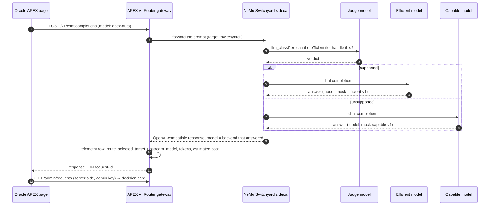
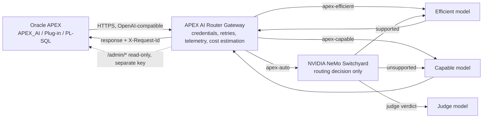

<h1 align="center">APEX AI Router</h1>

<p align="center">
  <strong>Smart model routing for Oracle APEX, decided per request by NVIDIA NeMo Switchyard.</strong>
</p>

<p align="center">
  <a href="https://github.com/B2DEV-TECH/apex-ai-router/actions/workflows/gateway-ci.yml"></a>
  <a href="LICENSE"></a>
  
  
  
  
  
</p>

<p align="center">
  <code>Smart Routing</code> · <code>Cost Visibility</code> · <code>Model Agnostic</code> · <code>APEX Native</code>
</p>

APEX AI Router is an open-source model-routing gateway for Oracle APEX
applications. Instead of sending every AI request to the same expensive
model, it uses [NVIDIA NeMo Switchyard](https://github.com/NVIDIA-NeMo/Switchyard)
— an open-source routing engine — to select between configured model tiers
based on the request. Oracle APEX can connect through its native
OpenAI-compatible Generative AI Service (`APEX_AI`) support with zero code
changes, or developers can use the included `APEX_AI_ROUTER` PL/SQL package
or the optional APEX Dynamic Action plug-in.

<p align="center">
  
</p>
<p align="center">
  <sub>The demo application's <strong>Routing Dashboard</strong>, read live from the gateway's admin API during the 2026-09-17 validation run (local mock providers, every cost is $0.00). The "Auto requests answered by the efficient model" tile comes from the <code>upstream_model</code> telemetry: the backend NeMo Switchyard actually chose, per request.</sub>
</p>

## Highlights

- **One endpoint for APEX.** The gateway speaks the OpenAI chat-completions
  API, so APEX reaches it through its native `APEX_AI` Generative AI
  Service, the bundled Dynamic Action plug-in, or the `APEX_AI_ROUTER`
  PL/SQL package — pick one, keep the others optional.
- **`apex-auto` is decided by NeMo Switchyard, not by a hard-coded rule.**
  The sidecar runs its `llm_classifier` policy: a judge model says whether
  the efficient tier can handle the prompt, and Switchyard forwards it to
  the efficient or capable backend. `apex-efficient` and `apex-capable`
  stay available as fixed baselines.
- **Every routing decision is observable.** The backend that answered is
  stored as `upstream_model`, shown on the APEX page for that exact request
  id, aggregated in the Dashboard, and cross-checkable against the
  sidecar's own routing log and the model's own reply.
- **Cost is estimated, never invented.** Every number is an *estimate* from
  `config/pricing.yaml` against an all-capable baseline; the wording says so
  on every page. No savings figure is published anywhere in this repository.
- **Content stays out of the telemetry.** By default the gateway stores
  request metadata only; the `/admin/*` API never returns prompt or
  response text, and APEX pages read it server-side with a separate
  read-only admin credential.
- **Validated live, with the evidence committed.** Oracle Database 23ai
  Free, APEX 26.1, the PL/SQL package, the exported plug-in and the
  four-page demo were exercised end to end on 2026-09-17 with the
  Switchyard sidecar running — screenshots, an automated browser QA script
  and a dated validation record are in the repository, not in a slide.

> **Status: 0.1.0, pre-release.** Phases 1-9 of the project's implementation
> plan are complete: the gateway, Switchyard-based `apex-auto` routing,
> telemetry/cost estimation, the Oracle/PL-SQL integration layer, the APEX
> plug-in, a demo application, and a synthetic benchmark harness all exist
> and are exercised by an automated test suite plus live validation on
> Oracle Database 23ai Free and APEX 26.1. The database objects compile and
> pass their smoke test, the PL/SQL package completes a gateway round trip,
> and the exported plug-in and four-page demo app were reimported and tested
> in clean application IDs — including `apex-auto` through a **running NeMo
> Switchyard sidecar**, with the backend it picked recorded in the gateway's
> telemetry and cross-checked against the sidecar's own routing log
> ([`docs/live-validation-walkthrough.md`](docs/live-validation-walkthrough.md)).
> No cost-reduction, quality-preservation, or performance claim appears
> anywhere in this repository unless it is backed by a real, committed
> benchmark run.

The router is deliberately **vendor-neutral**: it never hard-codes which
provider or model is "the cheap one" or "the smart one." Operators configure
an `efficient` target and a `capable` target — each can be any
OpenAI-compatible model from any provider — and Switchyard picks between
them per request when a page asks for `apex-auto`.

## Table of contents

1. [Why](#why)
2. [See it route](#see-it-route)
3. [The demo application, page by page](#the-demo-application-page-by-page)
4. [Architecture](#architecture)
5. [Quick start](#quick-start)
6. [Three ways to call it from APEX](#three-ways-to-call-it-from-apex)
7. [Routing modes](#routing-modes)
8. [Provider configuration](#provider-configuration)
9. [Telemetry and admin API](#telemetry-and-admin-api)
10. [Benchmark](#benchmark)
11. [Validation record](#validation-record)
12. [What this proves, and what it does not](#what-this-proves-and-what-it-does-not)
13. [Security model](#security-model)
14. [Roadmap](#roadmap)
15. [Contributing](#contributing)
16. [License](#license)

## Why

Oracle APEX's native `APEX_AI` support is excellent for wiring AI into an
application, but it talks to one configured model. Some prompts — "explain
this validation message," "summarize this record" — don't need a frontier
model. Others — "generate this PL/SQL package," "reason about conflicting
business rules" — do. APEX AI Router sits between APEX and the model
providers and makes that choice automatically, while remaining fully
optional and easy to remove: point `APEX_AI` back at a model directly and
the application keeps working.

## See it route

Same page, same `Auto` route, two prompts. The short one lands on the
efficient backend, the long one on the capable backend — and the
**Routing decision** card is not a guess: it is read back from the gateway
telemetry for that request id after the answer arrives.

<table>
  <tr>
    <td width="50%" valign="top">
      
    </td>
    <td width="50%" valign="top">
      
    </td>
  </tr>
  <tr>
    <td><sub><strong>Short prompt → efficient.</strong> <code>apex-auto</code> → target <code>switchyard</code> → backend <code>mock-efficient-v1</code>. The response text starts with the mock's own echo, <code>[mock:efficient:mock-efficient-v1]</code>.</sub></td>
    <td><sub><strong>Long prompt → capable.</strong> Same route, same target; the sidecar's judge classified the prompt as unsupported by the efficient tier, so the backend that answered is <code>mock-capable-v1</code>.</sub></td>
  </tr>
</table>

What happens behind the Send button on the `Auto` route:



The same decision is written down in four places by three different
components, which is what makes it checkable:

| Where | What you see | Written by |
|---|---|---|
| The response text | `[mock:efficient:mock-efficient-v1] response to: …` | the mock model itself (it echoes its tier and id) |
| Gateway telemetry, `GET /admin/requests` | `route = apex-auto`, `selected_target = switchyard`, `upstream_model = mock-efficient-v1` | the gateway |
| The APEX page | "Backend that answered", the tier, tokens, estimated cost and the request id, on the Playground card and as a badge in Request History | APEX, reading the gateway telemetry server-side |
| The sidecar routing log (`--routing-log-file`, e.g. `.tools/switchyard/routing.jsonl`) | two JSON lines per Auto request: the judge call, then the backend it chose, with its `tier` — and nothing at all for the fixed routes | NeMo Switchyard |

The gateway cannot fabricate the sidecar's log, and the sidecar cannot write
the gateway's telemetry. Section 6 of the
[walkthrough](docs/live-validation-walkthrough.md#6-cross-check-outside-apex)
is the copy/paste version of this cross-check.

## The demo application, page by page

`apex-demo/f1213.sql` is a sanitized APEX 26.1 export of a four-page
reference application (`apex-demo/`). It exists to make the gateway's own
behavior visible; the reusable pieces an application would actually adopt
are `database/` and `apex-plugin/`. Every screenshot below was taken by the
automated browser QA (`apex-demo/qa/browser_qa.mjs`) during the 2026-09-17
run, against the local gateway, the mock providers and the running
Switchyard sidecar.

### Playground — one prompt, one decision

The Send button calls an APEX Ajax process (`apex_ai_router_demo.ajax_run`);
the browser never holds a gateway credential. Route `Auto` goes through the
sidecar; `Efficient` and `Capable` are fixed routes that bypass the
classifier — which is why, on the fixed route below, the card says so and
shows no baseline or savings.

<p align="center">
  
</p>
<p align="center">
  <sub><strong>Fixed route and plug-in checks.</strong> On <code>apex-efficient</code> the classifier is not involved, so baseline and savings are <code>n/a</code> by design. The three buttons at the bottom exercise the reusable <em>APEX AI Router — Generate</em> Dynamic Action plug-in with each prompt source it supports (Static Text, Item, JavaScript Expression).</sub>
</p>

### Dashboard — the routing story in aggregate

The hero image at the top of this page. KPI tiles come from
`/admin/metrics/summary`; the four JET charts and the backends table are
plain SQL `json_table` queries over `/admin/metrics/backends` and
`/admin/metrics/daily`, executed in the database with the admin
credential. Prompt and response content are never
exposed — the admin API does not return them.

### Request History — every request, with the backend that answered

<p align="center">
  
</p>
<p align="center">
  <sub><strong>A native Interactive Report</strong> over <code>GET /admin/requests</code> (latest 500), so filter, sort, highlight and download work as usual. The <em>Backend that answered</em> badge is <code>upstream_model</code>; the request ids match the Playground cards of the same session one for one.</sub>
</p>

### Configuration Help — what the gateway is running with

<p align="center">
  
</p>
<p align="center">
  <sub><strong>Routes and resolved targets</strong> read from <code>/admin/routes</code>, health from <code>/health</code> and <code>/ready</code>. The page shows environment-variable <em>names</em> and model ids, never a key value or an <code>Authorization</code> header.</sub>
</p>

Page-by-page build notes, item lists and the dated QA checklists live in
[`apex-demo/README.md`](apex-demo/README.md) and `apex-demo/pages/`.

## Architecture



Responsibilities are kept separate on purpose:

- **Oracle APEX** owns application behavior, user interaction, and page
  processes. It only ever talks to one OpenAI-compatible endpoint.
- **The gateway** (`gateway/`) owns provider credentials, HTTP calls,
  retries, timeouts, request validation, cost estimation, and telemetry. It
  is the only component that knows about real provider endpoints and keys.
- **NeMo Switchyard** owns the `apex-auto` routing decision only —
  efficient vs. capable — nothing else. It never sees provider credentials
  and is reached only through the gateway, over an internal sidecar HTTP
  call (`deploy/switchyard/`).

### Repository layout

```text
apex-ai-router/
├── gateway/        OpenAI-compatible FastAPI gateway (Python) -- routing, telemetry, cost estimation
├── database/       Oracle DB objects + APEX_AI_ROUTER PL/SQL package (AIR_ prefix)
├── apex-plugin/    Optional "APEX AI Router - Generate" Dynamic Action plug-in
├── apex-demo/      Reference APEX application (f1213.sql, support package, headless browser QA)
├── benchmark/      Synthetic, Oracle/APEX-flavored benchmark harness (fixed vs. apex-auto)
├── deploy/         Switchyard sidecar build/run instructions and rendered config
├── docs/           Setup guides, smoke test, live validation walkthrough (+ screenshots)
├── scripts/        Helpers: render/run the Switchyard sidecar locally, sanitize APEX exports
└── .github/        CI workflows
```

## Quick start

Requires Python 3.12+ and [`uv`](https://docs.astral.sh/uv/) (or plain
`pip`, which also works against `gateway/pyproject.toml`). Nothing below
needs a real model provider: the repository ships mock upstreams and a
deterministic mock judge, so the whole path — including Switchyard — runs
on a laptop.

### 1. Gateway and mock providers

```sh
cd gateway
uv sync
uv run uvicorn apex_ai_router.main:app --reload --port 8080
curl http://localhost:8080/health
curl http://localhost:8080/ready
```

`/ready` reports `not_ready` with a specific, sanitized reason (e.g. an
unresolved `${VAR}` in `routing.yaml`) until `APEX_AI_ROUTER_API_KEYS` and
real model targets are configured — see `.env.example` for every variable.
Without a real model provider configured, use the included mock upstream to
exercise the full request path locally:

```sh
cp .env.example .env
docker compose up --build          # gateway on 8080, mock efficient on 9001, mock capable + judge on 9002
curl http://localhost:8080/health
curl -X POST http://localhost:8080/v1/chat/completions \
  -H "Authorization: Bearer $(grep APEX_AI_ROUTER_API_KEYS .env | cut -d= -f2)" \
  -H "Content-Type: application/json" \
  -d '{"model": "apex-efficient", "messages": [{"role": "user", "content": "hello"}]}'
```

### 2. The NeMo Switchyard sidecar (needed for `apex-auto`)

`apex-auto` is not implemented inside the gateway: the gateway forwards it
to `switchyard-server`, which classifies the prompt with the judge model and
calls the efficient or capable backend itself. Build the pinned commit once,
then render the sidecar config from `routing.yaml` + `.env`, validate it and
run it:

```sh
cargo install --locked \
  --git https://github.com/NVIDIA-NeMo/Switchyard.git \
  --rev 1759dfdff95ed2718f6dd2afef6541654bbd0116 \
  switchyard-server \
  --root .tools/switchyard

scripts/run_switchyard_local.sh --dry-run     # Linux/macOS/Git Bash
scripts/run_switchyard_local.sh
```

```powershell
scripts\run_switchyard_local.ps1 -DryRun      # Windows PowerShell
scripts\run_switchyard_local.ps1
```

When the gateway runs under `docker compose` and the sidecar on the host,
set `SWITCHYARD_BASE_URL=http://host.docker.internal:4000` in `.env`
(Docker Desktop). Details, including what the `--dry-run` catches:
[`deploy/switchyard/README.md`](deploy/switchyard/README.md).

The mock judge is deliberately simple and documented: a prompt of
`MOCK_JUDGE_WORD_LIMIT` words or fewer (default 40) is classified as
supported by the efficient model; anything longer goes to the capable
model. That is what makes the next step deterministic.

### 3. Prove the routing from the command line

```sh
# short prompt -> expected: efficient
curl -s http://localhost:8080/v1/chat/completions \
  -H "Authorization: Bearer $(grep APEX_AI_ROUTER_API_KEYS .env | cut -d= -f2)" \
  -H "Content-Type: application/json" \
  -d '{"model":"apex-auto","messages":[{"role":"user","content":"Explain what an Oracle sequence is in one sentence."}]}'

# long prompt (more than 40 words) -> expected: capable
curl -s http://localhost:8080/v1/chat/completions \
  -H "Authorization: Bearer $(grep APEX_AI_ROUTER_API_KEYS .env | cut -d= -f2)" \
  -H "Content-Type: application/json" \
  -d '{"model":"apex-auto","messages":[{"role":"user","content":"Review the following PL/SQL package for correctness, performance and security. It loads invoices in bulk, validates the customer, applies tax rules per state, writes an audit row per line and raises a business exception when the total differs from the header. Explain every problem you find and propose a corrected version with bind variables and explicit exception handling."}]}'

# the gateway's record of the same two requests: upstream_model is the backend that answered
curl -s "http://localhost:8080/admin/requests?limit=2" \
  -H "Authorization: Bearer $(grep APEX_AI_ROUTER_ADMIN_API_KEY .env | cut -d= -f2)"
```

The first answer starts with `[mock:efficient:mock-efficient-v1] response to:`,
the second with `[mock:capable:mock-capable-v1] response to:`, and the two
telemetry rows carry `selected_target = switchyard` with the matching
`upstream_model`.

### 4. Oracle Database and APEX

Run as the workspace's parsing schema (SQL*Plus or SQLcl, from the
repository root), then point the package at the gateway as seen *from the
database host* and import the demo:

```sql
@database/install.sql                        -- AIR_CONFIG, AIR_REQUEST_LOG, APEX_AI_ROUTER
@database/tests/smoke_test.sql               -- offline checks, no gateway needed
@apex-plugin/sql/install_plugin_package.sql  -- APEX_AI_ROUTER_DA (plug-in callbacks)
@apex-demo/sql/install_demo.sql              -- APEX_AI_ROUTER_DEMO + ADMIN_CREDENTIAL_STATIC_ID

update air_config
   set config_value = 'http://localhost:8080/v1'   -- keep the /v1 suffix
 where config_key = 'GATEWAY_BASE_URL';
commit;
```

Create two Web Credentials (an inference key and a *separate* admin key —
the gateway rejects an inference key on every `/admin/*` route by design),
then import `apex-demo/f1213.sql` from App Builder or with
`apex_application_install`. The exact steps, the `ORA-24247` network-ACL
note and the per-page checks are in
[`docs/live-validation-walkthrough.md`](docs/live-validation-walkthrough.md);
the automated version of the whole tour is `apex-demo/qa/browser_qa.mjs`
(Playwright, credentials from environment variables only).

Common tasks are also wrapped in the `Makefile` (`make install`, `make
lint`, `make test`, `make test-integration`, `make test-plugin`, `make run`,
`make docker-up`, `make docker-down`, `make benchmark-mock`,
`make benchmark-real`) — see it for the exact commands each target runs.
Before trusting any deployment, walk through
[`docs/smoke-test.md`](docs/smoke-test.md) — a copy/paste `curl` checklist,
including the checks that have and haven't actually been run before.

## Three ways to call it from APEX

### Native `APEX_AI` (no code)

The lowest-friction adoption path: **no plug-in, no PL/SQL package, no
application changes beyond configuration.** Point your APEX application's
existing Generative AI Service at the gateway (`apex-auto`,
`apex-efficient`, or `apex-capable` as the model) and it gets routing and
cost visibility for free. Full walkthrough, including the exact prerequisites
and how to verify it worked: [`docs/apex-ai-setup.md`](docs/apex-ai-setup.md).

```text
Generative AI Service
Provider:    OpenAI Compatible
Endpoint:    https://router.example.com/v1
Model:       apex-auto
```

### Dynamic Action plug-in (low code)

An optional **"APEX AI Router - Generate"** Dynamic Action plug-in
(`apex-plugin/`) — declarative route/temperature/result-item attributes, no
PL/SQL or JavaScript required for basic use. The three buttons on the demo
Playground are exactly this plug-in with its three prompt sources.

```text
Dynamic Action:  APEX AI Router - Generate
Prompt Source:   P10_PROMPT
Route:           Auto
Result:          P10_RESULT
```

### `APEX_AI_ROUTER` PL/SQL package (page processes, batch jobs)

```plsql
declare
    l_result clob;
begin
    l_result := apex_ai_router.generate(
        p_prompt => :P10_PROMPT,
        p_route  => apex_ai_router.c_route_auto
    );
    :P10_RESULT := l_result;
end;
/
```

Both the plug-in and the package are optional conveniences on top of the
native `APEX_AI` path above, not a second way to reach a model provider —
see [`apex-plugin/README.md`](apex-plugin/README.md) and
[`database/README.md`](database/README.md) for installation and the exact
versions used for live validation.

## Routing modes

Virtual models, exposed via `GET /v1/models`:

| Virtual model    | Strategy         | Behavior                                       |
|------------------|-------------------|-------------------------------------------------|
| `apex-auto`      | `llm_classifier`  | NeMo Switchyard classifies the request and chooses efficient vs. capable |
| `apex-efficient` | `fixed`           | Always routes to the configured efficient target |
| `apex-capable`   | `fixed`           | Always routes to the configured capable target |

`apex-efficient` and `apex-capable` exist specifically so `apex-auto` can be
benchmarked against fixed baselines instead of being taken on faith (see
[Benchmark](#benchmark)). Routing policy lives entirely in
`gateway/config/routing.yaml` — non-secret, safe to commit, and referencing
credentials only by environment variable name.

## Provider configuration

Providers are configured through environment variables (`.env`, see
[`.env.example`](.env.example)) plus the non-secret
`gateway/config/routing.yaml`:

```yaml
targets:
  efficient:
    provider: openai_compatible
    model: ${EFFICIENT_MODEL_ID}
    base_url: ${EFFICIENT_MODEL_BASE_URL}
    api_key_env: EFFICIENT_MODEL_API_KEY
```

Any OpenAI-compatible provider can fill an `efficient`/`capable`/`judge`
slot — the router never hard-codes a vendor. `apex-auto` additionally
requires the [NeMo Switchyard sidecar](deploy/switchyard/README.md)
running alongside the gateway; see that doc for the exact pinned build
commit and how to render its config from `routing.yaml`.

## Telemetry and admin API

By default, the gateway does not store prompt or response content — only
request metadata (route, selected target/provider/model, the upstream
model that actually answered, token counts, latency, estimated cost, retry
count), written to a local SQLite store
(`gateway/src/apex_ai_router/telemetry/`). For `apex-auto` the
`upstream_model` column is the backend NeMo Switchyard reports having
called, so the efficient/capable split of Auto traffic is observable from
the gateway alone. A dev-only opt-in
(`APEX_AI_ROUTER_TELEMETRY_LOG_CONTENT=true`) additionally persists
prompt/response content for local debugging; the `/admin/*` API never
returns it either way. See [`SECURITY.md`](SECURITY.md) for exactly what is
and isn't logged, and `database/README.md` for the separate, non-overlapping
`AIR_REQUEST_LOG` (APEX application/page/session context only).

Read access is via a distinct admin API key — an inference key cannot read
telemetry, by design:

| Endpoint | Key | Returns | Used by the demo app for |
|---|---|---|---|
| `GET /health`, `GET /ready` | none | liveness; readiness with a sanitized reason when not ready | status pills (Dashboard, Configuration Help) |
| `GET /v1/models` | inference | the three virtual models, ids taken from `routing.yaml` | OpenAI-compatible clients that list models |
| `POST /v1/chat/completions` | inference | OpenAI-compatible chat completion, `X-Request-Id` header | Playground, plug-in, PL/SQL package |
| `GET /admin/metrics/summary` | admin | requests, success rate, estimated cost / baseline / savings (`since`/`until` optional) | KPI tiles |
| `GET /admin/metrics/models` | admin | per-model breakdown: requests, success rate, tokens, estimated cost | reports outside the demo (the demo reads `backends` instead) |
| `GET /admin/metrics/backends` | admin | per-route split by `upstream_model`, with tokens and estimated cost | "Backend that answered", "Requests by route" and "Tokens per backend" charts, backends table |
| `GET /admin/metrics/daily` | admin | requests per day (UTC) | Requests-per-day chart |
| `GET /admin/requests` | admin | latest requests, metadata only (`limit` ≤ 500, `offset`) | Request History, Playground decision card |
| `GET /admin/routes` | admin | routes and resolved targets — env-var *names*, never values | Configuration Help |

## Benchmark

A synthetic, Oracle/APEX-flavored benchmark harness (`benchmark/`, 34
tasks across 14 categories — SQL/PL-SQL generation and explanation, JSON
extraction, business-rule reasoning, and more) compares fixed-efficient,
fixed-capable, and `apex-auto` routing on cost, latency, and deterministic
(plus optional LLM-judge) task scoring:

```sh
make benchmark-mock
```

`benchmark/results/mock-example/` is a real, committed run against the
local mock upstream — useful to see the report's shape, but explicitly
**not** representative of real model quality or real cost savings (the mock
always returns a fixed string at $0.00; see
[`benchmark/README.md`](benchmark/README.md) for the four specific reasons
why, and for how the report tells which backend `apex-auto` actually
called from the `upstream_model` telemetry). No `apex-auto` cost-savings
number is published anywhere in this
repository — running `make benchmark-real` against your own providers is
the only way to get one that means anything for your workload.

## Validation record

Run on 2026-09-17 against Oracle Database 23ai Free, APEX 26.1, the local
gateway, the mock providers and the NeMo Switchyard sidecar
(full write-up: [`docs/live-validation-walkthrough.md`](docs/live-validation-walkthrough.md#validation-record--2026-09-17)):

| Check | Result |
|---|---|
| Gateway test suite (`pytest`, unit + contract + integration) | 106 passed; `ruff` and `mypy` clean |
| Plug-in client test (`node --test`) | 10 passed |
| Sidecar config (`run_switchyard_local.ps1 -DryRun`, then run) | valid; sidecar on `127.0.0.1:4000`, routing log written per request |
| `apex-auto` from `curl` | short → `mock-efficient-v1`, long → `mock-capable-v1`, consistent in telemetry, routing log and response text |
| Browser QA, the demo application | passed three times (two during the build, once with the tracked `apex-demo/qa/browser_qa.mjs`): 0 failed expectations, 0 browser console errors; Auto short = efficient, Auto long = capable, fixed Efficient = efficient; plug-in 3 successes / 0 errors; 4 charts, 6 tiles; Request History rows all badged, both tiers present |
| Export → sanitize → reimport | `f1213.sql` reimported under another application id, same QA passed; the copy then removed |
| Database packages (`apex_ai_router`, `apex_ai_router_da`, `apex_ai_router_demo`) + `database/tests/smoke_test.sql` | recompiled with no errors, all objects VALID; required `AIR_CONFIG` keys present; unknown route raises `e_unknown_route` |

The first four rows can be reproduced without Oracle; the rest need the
Oracle setup from the quick start. Row counts and latencies will differ on
your machine and are not part of the claim. The `gateway-ci` workflow runs
`ruff`, `mypy` and the unit, contract and integration suites on every push
and pull request that touches `gateway/`.

## What this proves, and what it does not

**Proven on 2026-09-17:**

- The full path APEX page → PL/SQL → gateway → NeMo Switchyard → backend
  works, for the demo package and for the Dynamic Action plug-in, with the
  sidecar actually running and actually deciding.
- The decision is observable end to end: the backend that answered is
  recorded in the gateway's telemetry (`upstream_model`), shown in APEX,
  and agrees with the sidecar's routing log and with the model's own echo.
- Fixed routes bypass the classifier, as designed.
- The exported application imports cleanly into another application id and
  passes the same automated checks.

**Limitations, stated plainly:**

- **The live validation used local mock model providers.** Oracle Database
  23ai Free, APEX 26.1, the PL/SQL integration, the exported Dynamic Action
  plug-in, and all four demo pages were exercised end to end, with the NeMo
  Switchyard sidecar running: fixed efficient/capable routing passed and
  `apex-auto` sent short prompts to the efficient backend and long ones to
  the capable backend, as the mock judge's documented word-count rule
  dictates. The models echo the prompt and cost $0.00, so no real-provider
  quality or cost claim follows from this test.
- NeMo Switchyard is, by NVIDIA's own description, experimental / pre-alpha
  and not recommended for production use. This project uses it anyway,
  pinned to a specific commit (`deploy/switchyard/README.md`), and is
  explicit about that trade-off rather than hiding it.
- For `apex-auto`, the gateway knows which backend answered only because
  Switchyard reports it in the `model` field of its response, which the
  gateway stores as `upstream_model`. It does not see the classifier's
  score, threshold, or the judge call; the sidecar's routing log is the
  place for that. See
  [`benchmark/README.md`](benchmark/README.md#which-backend-did-apex-auto-actually-call-upstream_model).
- No cost-reduction, quality-preservation, or "production ready" claim is
  made anywhere in this repository unless backed by a benchmark run
  recorded in `benchmark/results/` against real providers.
- Streaming responses, additional provider-format adapters (only
  OpenAI-compatible and Switchyard exist today), and advanced routing
  strategies (stage/escalation/composite) are roadmap items, not present in
  0.1.
- SQLite telemetry is a single-process design (verified safe under this
  project's own single-event-loop execution model) — not built for
  multi-process horizontal scaling of the gateway against one database
  file.

See [`HANDOFF.md`](HANDOFF.md) for the complete list, with suggested next
steps for each.

## Security model

See [`SECURITY.md`](SECURITY.md) for the full threat model and status
table (TLS, credential isolation, log/telemetry content, request limits,
CORS, dependency pinning, concurrency safety — several of these are backed
by an automated test, not just a claim, per that file). In short: provider
keys live only in the gateway's environment; APEX holds gateway keys as Web
Credentials and calls the gateway from PL/SQL, never from the browser; the
admin key is separate from the inference key and read-only; and neither the
telemetry store (by default) nor the admin API carries prompt or response
content.

## Roadmap

- **0.1** (this release) — OpenAI-compatible gateway, Switchyard
  `llm_classifier` routing, efficient/capable/auto tiers, telemetry,
  estimated costs, native `APEX_AI` docs, `APEX_AI_ROUTER` PL/SQL package,
  validated APEX Dynamic Action plug-in, exported demo application,
  benchmark harness. Landed after 0.1.0 (see `CHANGELOG.md`, Unreleased):
  Switchyard backend-selection telemetry (`upstream_model`,
  `/admin/metrics/backends`) and the live Switchyard validation.
- **0.2** — Streaming; more provider adapters; route-level budgets.
- **0.3** — Stage/escalation/composite routing, workspace policies,
  configurable model pools, OpenTelemetry.
- **Future** — PII/data-masking integration, semantic caching, enterprise
  deployment, custom-trained router, OCI-native deployment templates.

See [`CHANGELOG.md`](CHANGELOG.md) for what has actually shipped, phase by
phase, including every caveat and fix discovered along the way, and
[`RELEASE_NOTES.md`](RELEASE_NOTES.md) for the release summary.

## Contributing

Issues and pull requests are welcome — see
[`CONTRIBUTING.md`](CONTRIBUTING.md) for the development setup, where the
tests live, and the ground rules: no customer or production data anywhere,
no fabricated numbers (if something wasn't measured here, say so), no
hard-coded vendor or model identity in code, no secrets committed. This
project follows the [`CODE_OF_CONDUCT.md`](CODE_OF_CONDUCT.md); security
reports go through [`SECURITY.md`](SECURITY.md).

## License

[Apache License 2.0](LICENSE).
