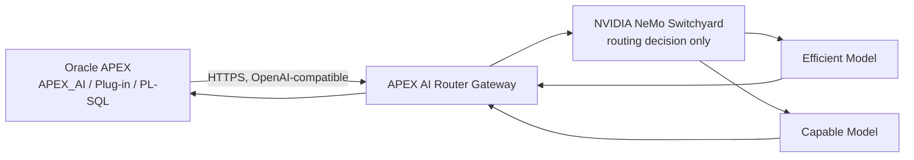

# APEX AI Router

**Smart model routing for Oracle APEX.**

APEX AI Router is an open-source model-routing gateway for Oracle APEX
applications. Instead of sending every AI request to the same expensive
model, it uses [NVIDIA NeMo Switchyard](https://github.com/NVIDIA-NeMo/Switchyard)
— an open-source routing engine — to select between configured model tiers
based on the request. Oracle APEX can connect through its native
OpenAI-compatible Generative AI Service (`APEX_AI`) support with zero code
changes, or developers can use the included `APEX_AI_ROUTER` PL/SQL package
or the optional APEX Dynamic Action plug-in.

```text
Smart Routing   ·   Cost Visibility   ·   Model Agnostic   ·   APEX Native
```

> **Status: 0.1.0, pre-release.** Phases 1-9 of the project's implementation
> plan are complete: the gateway, Switchyard-based `apex-auto` routing,
> telemetry/cost estimation, the Oracle/PL-SQL integration layer, the APEX
> plug-in, a demo application, and a synthetic benchmark harness all exist
> and are exercised by an automated test suite plus live validation on
> Oracle Database 23ai Free and APEX 26.1. The database objects compile and
> pass their smoke test, the PL/SQL package completes a gateway round trip,
> and the exported plug-in and four-page demo app were reimported and tested
> in clean application IDs — including `apex-auto` through a **running NeMo
> Switchyard sidecar**, with the backend it picked recorded in the gateway's
> telemetry and cross-checked against the sidecar's own routing log
> ([`docs/live-validation-walkthrough.md`](docs/live-validation-walkthrough.md)).
> No cost-reduction, quality-preservation, or performance claim appears
> anywhere in this repository unless it is backed by a real, committed
> benchmark run.

The router is deliberately **vendor-neutral**: it never hard-codes which
provider or model is "the cheap one" or "the smart one." Operators configure
an `efficient` target and a `capable` target — each can be any
OpenAI-compatible model from any provider — and Switchyard picks between
them per request when a page asks for `apex-auto`.

## Table of contents

1. [What it is](#apex-ai-router) / [Why](#why)
2. [Architecture](#architecture)
3. [Quick start](#quick-start)
4. [Native `APEX_AI` setup](#native-apex_ai-integration)
5. [Plug-in installation](#apex-plug-in)
6. [Routing modes](#routing-modes)
7. [Provider configuration](#provider-configuration)
8. [Telemetry](#telemetry)
9. [Benchmark](#benchmark)
10. [Security model](#security-model)
11. [Limitations](#limitations)
12. [Roadmap](#roadmap)
13. [License](#license)

## Why

Oracle APEX's native `APEX_AI` support is excellent for wiring AI into an
application, but it talks to one configured model. Some prompts — "explain
this validation message," "summarize this record" — don't need a frontier
model. Others — "generate this PL/SQL package," "reason about conflicting
business rules" — do. APEX AI Router sits between APEX and the model
providers and makes that choice automatically, while remaining fully
optional and easy to remove: point `APEX_AI` back at a model directly and
the application keeps working.

## Architecture



Responsibilities are kept separate on purpose:

- **Oracle APEX** owns application behavior, user interaction, and page
  processes. It only ever talks to one OpenAI-compatible endpoint.
- **The gateway** (`gateway/`) owns provider credentials, HTTP calls,
  retries, timeouts, request validation, cost estimation, and telemetry. It
  is the only component that knows about real provider endpoints and keys.
- **NeMo Switchyard** owns the `apex-auto` routing decision only —
  efficient vs. capable — nothing else. It never sees provider credentials
  and is reached only through the gateway, over an internal sidecar HTTP
  call (`deploy/switchyard/`).

### Repository layout

```
apex-ai-router/
├── gateway/        OpenAI-compatible FastAPI gateway (Python) -- routing, telemetry, cost estimation
├── database/       Oracle DB objects + APEX_AI_ROUTER PL/SQL package (AIR_ prefix)
├── apex-plugin/    Optional "APEX AI Router - Generate" Dynamic Action plug-in
├── apex-demo/      Reference APEX application (playground, dashboard, request history)
├── benchmark/      Synthetic, Oracle/APEX-flavored benchmark harness (fixed vs. apex-auto)
├── deploy/         Switchyard sidecar build/run instructions
├── docs/           Setup guides, smoke test, live validation walkthrough (+ screenshots)
├── scripts/        Helpers: render/run the Switchyard sidecar locally, sanitize APEX exports
└── .github/        CI workflows
```

## Quick start

Requires Python 3.12+ and [`uv`](https://docs.astral.sh/uv/) (or plain
`pip`, which also works against `gateway/pyproject.toml`).

```sh
cd gateway
uv sync
uv run uvicorn apex_ai_router.main:app --reload --port 8080
curl http://localhost:8080/health
curl http://localhost:8080/ready
```

`/ready` reports `not_ready` with a specific, sanitized reason (e.g. an
unresolved `${VAR}` in `routing.yaml`) until `APEX_AI_ROUTER_API_KEYS` and
real model targets are configured — see `.env.example` for every variable.
Without a real model provider configured, use the included mock upstream to
exercise the full request path locally:

```sh
cp .env.example .env
docker compose up --build
curl http://localhost:8080/health
curl -X POST http://localhost:8080/v1/chat/completions \
  -H "Authorization: Bearer $(grep APEX_AI_ROUTER_API_KEYS .env | cut -d= -f2)" \
  -H "Content-Type: application/json" \
  -d '{"model": "apex-efficient", "messages": [{"role": "user", "content": "hello"}]}'
```

Common tasks are also wrapped in the `Makefile` (`make install`, `make
test`, `make test-integration`, `make test-plugin`, `make run`, `make
docker-up`, `make benchmark-mock`) — see it for the exact commands each
target runs. Before trusting any deployment, walk through
[`docs/smoke-test.md`](docs/smoke-test.md) — a copy/paste `curl` checklist,
including the checks that have and haven't actually been run before. To
see the whole thing working — mocks, the Switchyard sidecar, Oracle, APEX
and the demo app, page by page —
follow [`docs/live-validation-walkthrough.md`](docs/live-validation-walkthrough.md).

## Native `APEX_AI` integration

The lowest-friction adoption path: **no plug-in, no PL/SQL package, no
application changes beyond configuration.** Point your APEX application's
existing Generative AI Service at the gateway (`apex-auto`,
`apex-efficient`, or `apex-capable` as the model) and it gets routing and
cost visibility for free. Full walkthrough, including the exact prerequisites
and how to verify it worked: [`docs/apex-ai-setup.md`](docs/apex-ai-setup.md).

```text
Generative AI Service
Provider:    OpenAI Compatible
Endpoint:    https://router.example.com/v1
Model:       apex-auto
```

## APEX plug-in

An optional **"APEX AI Router - Generate"** Dynamic Action plug-in
(`apex-plugin/`) for low-code usage — declarative route/temperature/result-item
attributes, no PL/SQL or JavaScript required for basic use:

```text
Dynamic Action:  APEX AI Router - Generate
Prompt Source:   P10_PROMPT
Route:           Auto
Result:          P10_RESULT
```

Or call the `APEX_AI_ROUTER` PL/SQL package directly (`database/`), for
page processes and batch jobs outside of a Dynamic Action:

```plsql
declare
    l_result clob;
begin
    l_result := apex_ai_router.generate(
        p_prompt => :P10_PROMPT,
        p_route  => apex_ai_router.c_route_auto
    );
    :P10_RESULT := l_result;
end;
/
```

Both the plug-in and the package are optional conveniences on top of the
native `APEX_AI` path above, not a second way to reach a model provider —
see [`apex-plugin/README.md`](apex-plugin/README.md) and
[`database/README.md`](database/README.md) for installation and the exact
versions used for live validation.

## Routing modes

Virtual models, exposed via `GET /v1/models`:

| Virtual model    | Strategy         | Behavior                                       |
|------------------|-------------------|-------------------------------------------------|
| `apex-auto`      | `llm_classifier`  | NeMo Switchyard classifies the request and chooses efficient vs. capable |
| `apex-efficient` | `fixed`           | Always routes to the configured efficient target |
| `apex-capable`   | `fixed`           | Always routes to the configured capable target |

`apex-efficient` and `apex-capable` exist specifically so `apex-auto` can be
benchmarked against fixed baselines instead of being taken on faith (see
[Benchmark](#benchmark)). Routing policy lives entirely in
`gateway/config/routing.yaml` — non-secret, safe to commit, and referencing
credentials only by environment variable name.

## Provider configuration

Providers are configured through environment variables (`.env`, see
[`.env.example`](.env.example)) plus the non-secret
`gateway/config/routing.yaml`:

```yaml
targets:
  efficient:
    provider: openai_compatible
    model: ${EFFICIENT_MODEL_ID}
    base_url: ${EFFICIENT_MODEL_BASE_URL}
    api_key_env: EFFICIENT_MODEL_API_KEY
```

Any OpenAI-compatible provider can fill an `efficient`/`capable`/`judge`
slot — the router never hard-codes a vendor. `apex-auto` additionally
requires the [NeMo Switchyard sidecar](deploy/switchyard/README.md)
running alongside the gateway; see that doc for the exact pinned build
commit and how to render its config from `routing.yaml`.

## Telemetry

By default, the gateway does not store prompt or response content — only
request metadata (route, selected target/provider/model, the upstream
model that actually answered, token counts, latency, estimated cost, retry
count), written to a local SQLite store
(`gateway/src/apex_ai_router/telemetry/`). For `apex-auto` the
`upstream_model` column is the backend NeMo Switchyard reports having
called, so the efficient/capable split of Auto traffic is observable from
the gateway alone. A dev-only opt-in
(`APEX_AI_ROUTER_TELEMETRY_LOG_CONTENT=true`) additionally persists
prompt/response content for local debugging; the `/admin/*` API never
returns it either way. See [`SECURITY.md`](SECURITY.md) for exactly what is
and isn't logged, and `database/README.md` for the separate, non-overlapping
`AIR_REQUEST_LOG` (APEX application/page/session context only).

Read access is via a distinct admin API key
(`/admin/metrics/summary`, `/admin/metrics/models`,
`/admin/metrics/backends`, `/admin/metrics/daily`, `/admin/requests`,
`/admin/routes`) — an inference key cannot read telemetry, by design.

## Benchmark

A synthetic, Oracle/APEX-flavored benchmark harness (`benchmark/`, 34
tasks across 14 categories — SQL/PL-SQL generation and explanation, JSON
extraction, business-rule reasoning, and more) compares fixed-efficient,
fixed-capable, and `apex-auto` routing on cost, latency, and deterministic
(plus optional LLM-judge) task scoring:

```sh
make benchmark-mock
```

`benchmark/results/mock-example/` is a real, committed run against the
local mock upstream — useful to see the report's shape, but explicitly
**not** representative of real model quality or real cost savings (the mock
always returns a fixed string at $0.00; see
[`benchmark/README.md`](benchmark/README.md) for the four specific reasons
why, and for how the report tells which backend `apex-auto` actually
called from the `upstream_model` telemetry). No `apex-auto` cost-savings
number is published anywhere in this
repository — running `make benchmark-real` against your own providers is
the only way to get one that means anything for your workload.

## Security model

See [`SECURITY.md`](SECURITY.md) for the full threat model and status
table (TLS, credential isolation, log/telemetry content, request limits,
CORS, dependency pinning, concurrency safety — several of these are backed
by an automated test, not just a claim, per that file).

## Limitations

- **The live validation used local mock model providers.** Oracle Database
  23ai Free, APEX 26.1, the PL/SQL integration, the exported Dynamic Action
  plug-in, and all four demo pages were exercised end to end, with the NeMo
  Switchyard sidecar running: fixed efficient/capable routing passed and
  `apex-auto` sent short prompts to the efficient backend and long ones to
  the capable backend, as the mock judge's documented word-count rule
  dictates. The models echo the prompt and cost $0.00, so no real-provider
  quality or cost claim follows from this test.
- NeMo Switchyard is, by NVIDIA's own description, experimental / pre-alpha
  and not recommended for production use. This project uses it anyway,
  pinned to a specific commit (`deploy/switchyard/README.md`), and is
  explicit about that trade-off rather than hiding it.
- For `apex-auto`, the gateway knows which backend answered only because
  Switchyard reports it in the `model` field of its response, which the
  gateway stores as `upstream_model`. It does not see the classifier's
  score, threshold, or the judge call; the sidecar's routing log is the
  place for that. See
  [`benchmark/README.md`](benchmark/README.md#which-backend-did-apex-auto-actually-call-upstream_model).
- No cost-reduction, quality-preservation, or "production ready" claim is
  made anywhere in this repository unless backed by a benchmark run
  recorded in `benchmark/results/` against real providers.
- Streaming responses, additional provider-format adapters (only
  OpenAI-compatible and Switchyard exist today), and advanced routing
  strategies (stage/escalation/composite) are roadmap items, not present in
  0.1.
- SQLite telemetry is a single-process design (verified safe under this
  project's own single-event-loop execution model) — not built for
  multi-process horizontal scaling of the gateway against one database
  file.

See [`HANDOFF.md`](HANDOFF.md) for the complete list, with suggested next
steps for each.

## Roadmap

- **0.1** (this release) — OpenAI-compatible gateway, Switchyard
  `llm_classifier` routing, efficient/capable/auto tiers, telemetry,
  estimated costs, native `APEX_AI` docs, `APEX_AI_ROUTER` PL/SQL package,
  validated APEX Dynamic Action plug-in, exported demo application,
  benchmark harness. Landed after 0.1.0 (see `CHANGELOG.md`, Unreleased):
  Switchyard backend-selection telemetry (`upstream_model`,
  `/admin/metrics/backends`) and the live Switchyard validation.
- **0.2** — Streaming; more provider adapters; route-level budgets.
- **0.3** — Stage/escalation/composite routing, workspace policies,
  configurable model pools, OpenTelemetry.
- **Future** — PII/data-masking integration, semantic caching, enterprise
  deployment, custom-trained router, OCI-native deployment templates.

See [`CHANGELOG.md`](CHANGELOG.md) for what has actually shipped, phase by
phase, including every caveat and fix discovered along the way.

## License

[Apache License 2.0](LICENSE).
