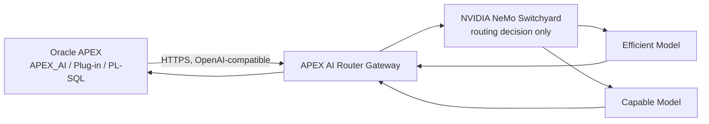

# APEX AI Router

APEX AI Router is an open-source model-routing gateway for Oracle APEX
applications. Instead of sending every AI request to the same model
regardless of how simple or complex it is, the gateway uses
[NVIDIA NeMo Switchyard](https://github.com/NVIDIA-NeMo/Switchyard) — an
open-source routing engine — to select between configured model tiers based
on the request. Oracle APEX can connect through its native OpenAI-compatible
Generative AI Service support, or developers can use the included APEX
plug-in and PL/SQL API.

The router is deliberately **vendor-neutral**: it never hard-codes which
provider or model is "the cheap one" or "the smart one." Operators configure
an `efficient` target and a `capable` target — each can be any
OpenAI-compatible model from any provider — and the router picks between
them per request.

> **Status: early development.** This repository is being built in phases
> (see [Roadmap](#roadmap)). Sections below describe the target design;
> anything not yet implemented is marked as such. Nothing in this README is
> a performance, cost-savings, or compatibility claim until it has been
> measured — see [Limitations](#limitations).

## Why

Oracle APEX's native `APEX_AI` support is excellent for wiring AI into an
application, but it talks to one configured model. Some prompts — "explain
this validation message," "summarize this record" — don't need a frontier
model. Others — "generate this PL/SQL package," "reason about conflicting
business rules" — do. APEX AI Router sits between APEX and the model
providers and makes that choice automatically, while remaining fully
optional and easy to remove: point `APEX_AI` back at a model directly and
the application keeps working.

## Architecture



Responsibilities are kept separate on purpose:

- **Oracle APEX** owns application behavior, user interaction, and page
  processes. It only ever talks to one OpenAI-compatible endpoint.
- **The gateway** (`gateway/`) owns provider credentials, HTTP calls,
  retries, timeouts, request validation, cost estimation, and telemetry. It
  is the only component that knows about real provider endpoints and keys.
- **NeMo Switchyard** owns the routing decision only — efficient vs.
  capable — nothing else. It never sees provider credentials.

## Repository layout

```
apex-ai-router/
├── gateway/        OpenAI-compatible FastAPI gateway (Python)
├── database/       Oracle DB objects + PL/SQL API (AIR_ prefix)
├── apex-plugin/    Optional APEX Dynamic Action plug-in
├── apex-demo/      Demo APEX application (playground, dashboard, history)
├── benchmark/      Synthetic APEX-workload benchmark harness
├── docs/           Setup guides, architecture notes, security model
└── .github/        CI workflows
```

## Quick start

Only the gateway skeleton exists today — structured logging, settings
loading, and health/readiness endpoints, plus local mock upstream model
servers. There is no routing, no `/v1/chat/completions`, and no real
provider traffic yet.

```sh
cd gateway
uv sync
uv run uvicorn apex_ai_router.main:app --reload --port 8080
curl http://localhost:8080/health
curl http://localhost:8080/ready
```

Or via Docker Compose from the repository root (starts the gateway plus two
mock upstream model servers used for local development — no paid provider
credentials required):

```sh
cp .env.example .env
docker compose up --build
curl http://localhost:8080/health
```

## Native APEX_AI integration

Documentation for configuring an Oracle APEX Generative AI Service to point
at this gateway will live in `docs/apex-ai-setup.md` once the
`/v1/chat/completions` endpoint exists (Phase 2). Not yet written.

## APEX plug-in

The optional "APEX AI Router - Generate" Dynamic Action plug-in
(`apex-plugin/`) is planned for a later phase. The router's core promise —
one OpenAI-compatible endpoint, routed automatically — does not require it;
existing `APEX_AI` usage will keep working by pointing at the gateway
directly.

## Routing modes

Planned virtual models, exposed via `/v1/models` once implemented:

| Virtual model    | Policy      | Behavior                                   |
|------------------|-------------|---------------------------------------------|
| `apex-auto`      | `AUTO`      | NeMo Switchyard chooses efficient vs. capable |
| `apex-efficient` | `EFFICIENT` | Always routes to the configured efficient target |
| `apex-capable`   | `CAPABLE`   | Always routes to the configured capable target |

`apex-efficient` and `apex-capable` exist specifically so `apex-auto` can be
benchmarked against fixed baselines instead of being taken on faith.

## Provider configuration

Providers are configured through environment variables and a routing config
file — never hard-coded. See `.env.example` for the exact variables once
routing is implemented (Phase 3).

## Telemetry

By default, the gateway does not store prompt or response content — only
request metadata (route, selected target, token counts, latency, estimated
cost). See `docs/telemetry.md` (planned) for the exact schema.

## Benchmark

A synthetic, Oracle/APEX-flavored benchmark suite (`benchmark/`) will
compare fixed-efficient, fixed-capable, and `apex-auto` routing on cost,
latency, and task success — using deterministic scoring wherever possible.
No results exist yet; none will be published without an actual measured
run.

## Security model

See [SECURITY.md](SECURITY.md).

## Limitations

- NeMo Switchyard is, by NVIDIA's own description, experimental / pre-alpha
  and not recommended for production use. This project is honest about
  that and will document exactly which commit was tested.
- No cost-reduction, quality-preservation, or "production ready" claims are
  made anywhere in this repository unless backed by a benchmark run
  recorded in `benchmark/results/`.
- Streaming, multiple provider adapters, and advanced routing strategies
  (stage/escalation/composite) are roadmap items, not present in 0.1.

## Roadmap

- **0.1** — OpenAI-compatible gateway, Switchyard LLM-classifier routing,
  efficient/capable tiers, telemetry, estimated costs, native `APEX_AI`
  docs, APEX Dynamic Action plug-in, benchmark harness.
- **0.2** — Streaming, more provider adapters, route-level budgets, routing
  presets, improved APEX dashboard.
- **0.3** — Stage/escalation/composite routing, workspace policies,
  configurable model pools, OpenTelemetry.
- **Future** — PII/data-masking integration, semantic caching, enterprise
  deployment, custom-trained router, OCI-native deployment templates.

## License

[Apache License 2.0](LICENSE).
