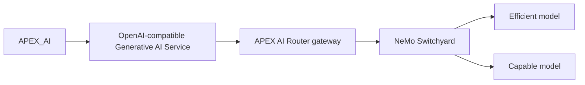

# Native `APEX_AI` integration

This is the lowest-friction way to adopt APEX AI Router: **no plug-in, no
PL/SQL package, no application changes beyond configuration.** If your APEX
application already calls Oracle's built-in `APEX_AI` package (or uses a
declarative Generative AI feature built on it), you can point it at the
gateway instead of a directly-configured provider and get routing + cost
visibility for free. Spec section 45 calls this out explicitly: the plug-in
(`apex-plugin/`, Phase 6) and the `APEX_AI_ROUTER` PL/SQL package
(`database/`, Phase 5) are both optional conveniences on top of this path,
not requirements for it.

The flow:



`APEX_AI` talks to whatever "Generative AI Service" is configured for it in
Shared Components, exactly as it would talk to OpenAI directly -- the only
difference is that service's endpoint and model point at your APEX AI
Router gateway instead, and `model=apex-auto` lets the Switchyard (Phase 3)
choose efficient vs. capable per request instead of your application
hard-coding a specific provider model.

## Prerequisites

- An APEX AI Router gateway reachable over HTTPS from your APEX instance
  (self-hosted per `gateway/README.md`, or a shared deployment your team
  runs).
- A gateway inference API key (see `gateway/README.md` for issuing one).
- An Oracle APEX version whose Builder exposes a Generative AI Service /
  `APEX_AI` configuration screen under Shared Components. This has shipped
  in recent APEX releases as `APEX_AI`-related functionality has evolved
  quickly across versions.

## Configuration

> **Read this before following the steps below.** The exact screen name,
> field labels, and navigation path for configuring a Generative AI Service
> have changed across APEX releases. The plug-in and demo were validated in
> APEX 26.1, but the native Generative AI Service screen itself was not part
> of that validation. The steps below describe the **conceptual** flow the
> spec requires (spec section 17); confirm the literal screen/field names
> against your own installed APEX version's Builder and documentation
> before following them verbatim. Do not assume a name below is exactly
> right just because it appears in this file.

1. In APEX Builder, go to **App Builder > Shared Components** and look for
   the Generative AI / `APEX_AI` service configuration area (in versions
   that have it, this is typically near "Generative AI Services" or
   similar wording under a "AI" or "Automation" grouping -- verify the
   exact location in your version).
2. Create a **Web Credential** (Shared Components > Web Credentials) of
   type "HTTP Header" holding your gateway API key as
   `Authorization: Bearer <key>`. Do not paste the key directly into the
   Generative AI Service definition if APEX offers a credential reference
   instead -- keep it in one place, consistent with how `database/README.md`
   handles the same key for the PL/SQL package.
3. Create (or edit) a Generative AI Service with settings conceptually
   equivalent to:

   ```text
   Provider:    OpenAI-compatible
   Endpoint:    https://router.example.com/v1
   Model:       apex-auto
   Credential:  <the Web Credential from step 2>
   ```

   Replace `https://router.example.com/v1` with your gateway's real base
   URL, including the `/v1` path segment. Use `apex-auto` to let the
   Switchyard route each request; use `apex-efficient` or `apex-capable`
   directly if a specific page or feature should always use one tier (see
   `docs/routing.md` if present, or `gateway/README.md`, for what each
   virtual model means).
4. Save, then exercise whatever APEX feature or page process calls
   `APEX_AI` in your application as you normally would. Requests will flow
   through the gateway and appear in its telemetry (`/admin/requests`,
   Phase 4) like any other gateway-routed call.

## Verifying it worked

- Check the gateway's own telemetry (`gateway`'s `/admin/requests` and
  `/admin/models` endpoints, or its logs) for a request matching the time
  you exercised the APEX feature.
- If APEX reports an error calling the service, check the gateway's logs
  first (it returns sanitized errors by design -- see
  `gateway/README.md`'s security section) and confirm the endpoint, model
  name, and credential are exactly as configured above.

## Removing it

Point the Generative AI Service back at a direct provider endpoint and
credential, or delete it. Nothing about this integration changes APEX
application code, so removal is a configuration-only change, matching the
"easy to remove from an APEX application without invasive changes" goal in
the project's own non-goals/goals list.

## Relationship to the plug-in and the PL/SQL package

| Path | Requires | Best for |
|---|---|---|
| Native `APEX_AI` (this doc) | Only a Generative AI Service configuration | Apps already using `APEX_AI`; zero code changes |
| `APEX_AI_ROUTER` PL/SQL package (`database/`) | Installing the package + Web Credential | PL/SQL-driven logic (page processes, batch jobs) outside of `APEX_AI` |
| APEX plug-in (`apex-plugin/`) | Installing the plug-in | Low-code Dynamic Action UX with route/temperature/result-item attributes, no PL/SQL to write |

All three ultimately call the same gateway and the same Switchyard routing
-- pick whichever matches how a given page or process already works.
